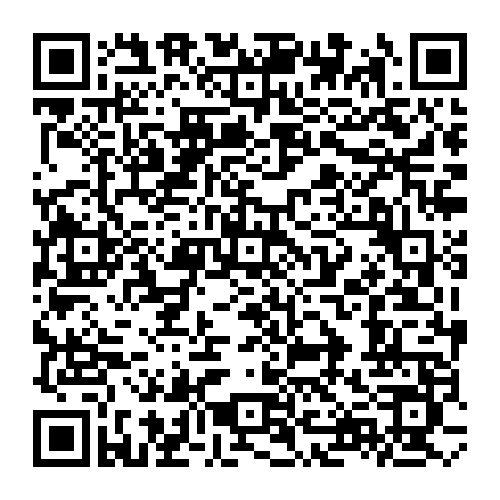

# QR Code Generator
[](LICENSE)
[](https://golang.org/)
[](https://godoc.org/github.com/YuriyLisovskiy/qrcode/qr)
[](https://travis-ci.org/YuriyLisovskiy/qrcode)
### Installation
```
$ go get github.com/YuriyLisovskiy/qrcode/qr
```
### Usage
Import package with
```go
import "github.com/YuriyLisovskiy/qrcode/qr"
```
```go
// Create an instance of Generator.
qrGen := qr.Generator{}

// Encode the text.
qrGen = qrGen.EncodeText("https://github.com/YuriyLisovskiy")

// Create an image of generated qr code.
qrGen.DrawImage("path/to/qr.png", 4, 500)
```
#### Result image:
<p align="center">
  <a href="https://github.com/YuriyLisovskiy/qrcode/blob/master/sample/qr.png"></a>
</p>

### Run
* tests: `make test`
* demo: `make demo`
### Author
* [Yuriy Lisovskiy](https://github.com/YuriyLisovskiy)
#### Donations
* Bitcoin: `1KfafTH4fSodRHw6Lc9nnGs58sibXrYEv7`
* Ether: `0x53c554400ca9d6dd5c56739c27bd79fd14fca851`
* Bitcoin Cash: `qrxtu27d9me0h3336yjcqjw6fz9g3esley8cf09ylc`
### License
This project is licensed under the Apache License 2.0 - see the [LICENSE](LICENSE) file for details.
